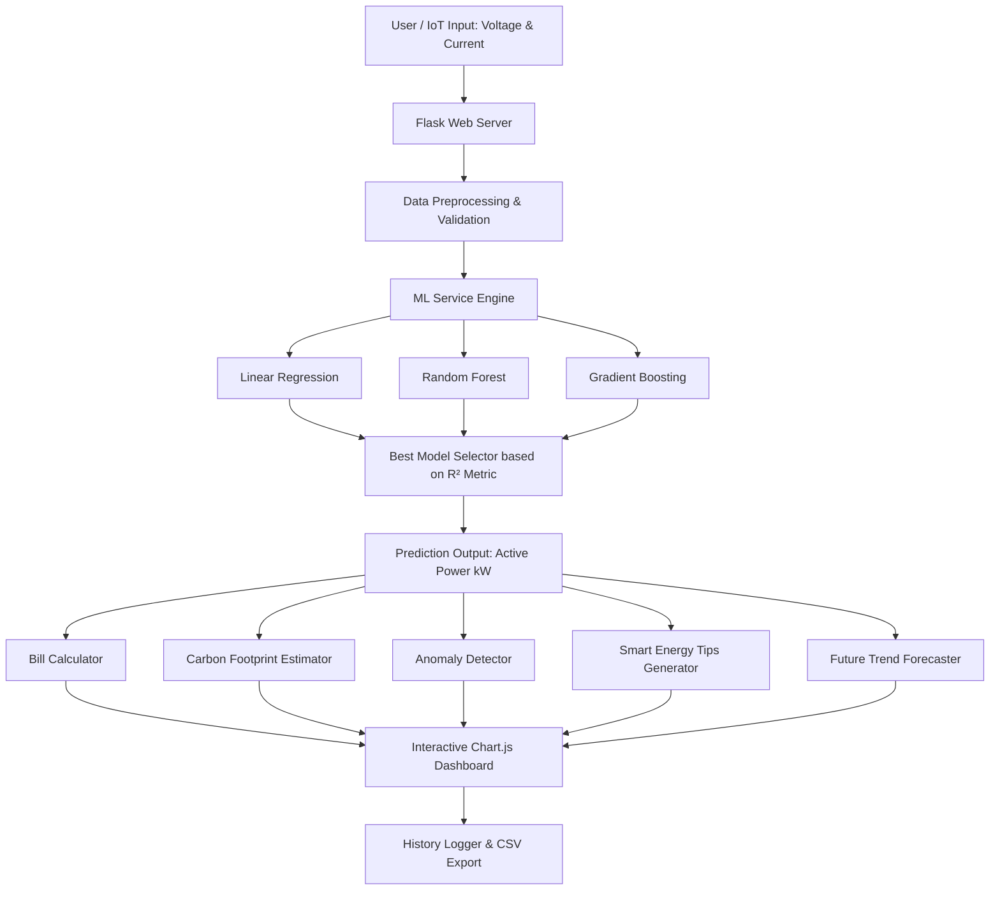

# ⚡ Smart Energy AI — Intelligent Energy Prediction & Analytics Dashboard

[](https://www.python.org/)
[](https://flask.palletsprojects.com/)
[](https://scikit-learn.org/)
[](LICENSE)

An end-to-end Machine Learning web application designed to predict real-time electrical power consumption, detect load anomalies, calculate estimated electricity bills and carbon footprints, and deliver actionable energy-saving tips through an interactive analytics dashboard.

---

## 🌟 Key Features

* **🤖 Multi-Model Machine Learning Pipeline**: Trains and compares multiple models (**Linear Regression**, **Random Forest**, **Gradient Boosting**) and automatically serves predictions using the highest $R^2$ scoring model.
* **⚡ Real-time Power Prediction**: Predicts household active power (in kW) based on real-time voltage and global current intensity.
* **💰 Cost & Tariff Estimation**: Real-time electricity billing estimation based on power usage per unit rate.
* **🌱 Carbon Footprint Tracker**: Quantifies environmental impact with estimated CO₂ greenhouse gas emissions ($1\text{ kWh} \approx 0.82\text{ kg CO}_2$).
* **🚨 Anomaly Detection**: Instant anomaly warning system flagging dangerous loads and power spikes.
* **💡 AI Smart Tips**: Dynamic, context-aware recommendations to optimize household appliance usage during peak hours.
* **📈 Trend & Future Forecasting**: Simulated multi-step future consumption trends.
* **📊 Visual Analytics**: Live interactive charts powered by **Chart.js** displaying historical power vs. bill trends.
* **📥 CSV Export**: Comprehensive history logging and 1-click CSV report downloads.

---

## 🏗️ System Architecture



---

## 📂 Project Structure

```text
smart-energy-ai/
├── docs/                      # Documentation and project reports
│   └── Final_Project_Report.docx
├── models/                    # Serialized machine learning models
│   ├── gradient_boosting.pkl
│   ├── linear_regression.pkl
│   ├── random_forest.pkl
│   └── model_metrics.csv
├── static/                    # Dashboard UI styling and client-side logic
│   ├── script.js
│   └── style.css
├── templates/                 # Jinja2 HTML templates
│   ├── dashboard.html
│   ├── history.html
│   ├── index.html
│   └── login.html
├── anomaly.py                 # Anomaly detection threshold engine
├── app.py                     # Flask server and API endpoints
├── data_sample.csv            # Sample dataset for fast training/testing
├── future_predict.py          # Future trend forecasting module
├── ml_service.py              # ML inference, carbon & tip generation
├── preprocess.py              # Dataset cleaning and transformation
├── train_models.py            # Model training, evaluation & serialization
├── requirements.txt           # Python package dependencies
├── .env.example               # Example environment variable template
├── .gitignore                 # Files and folders excluded from Git
├── LICENSE                    # MIT License
└── README.md                  # Project documentation
```

---

## 🚀 Quick Start & Installation

### 1. Clone the Repository
```bash
git clone https://github.com/Girish-DataLab/smart-energy-ai.git
cd smart-energy-ai
```

### 2. Create and Activate a Virtual Environment
```bash
# Windows
python -m venv venv
venv\Scripts\activate

# macOS / Linux
python3 -m venv venv
source venv/bin/activate
```

### 3. Install Dependencies
```bash
pip install -r requirements.txt
```

### 4. (Optional) Re-train ML Models
The repository includes pre-trained models. To re-train or evaluate on fresh data:
```bash
python train_models.py
```

### 5. Run the Application
```bash
python app.py
```
Open your browser and navigate to: **`http://127.0.0.1:5000/`**

---

## 🔐 Default Login Credentials

| Username | Password | Role |
| :--- | :--- | :--- |
| `admin` | `1234` | Administrator |

*(Credentials and session secret key can be customized using environment variables or a `.env` file).*

---

## 🔌 API Reference

### 1. Predict Energy Consumption
* **Endpoint:** `POST /api/predict`
* **Request Body:**
  ```json
  {
    "voltage": 235.5,
    "intensity": 18.4
  }
  ```
* **Response:**
  ```json
  {
    "prediction": 4.33,
    "bill": 30.31,
    "carbon": 3.55,
    "tip": "High usage ⚠ Consider optimizing appliances and AC usage",
    "anomaly": "Slightly high usage ⚡",
    "best_model": "Gradient Boosting",
    "future": [4.55, 4.76, 4.98, 5.2, 5.41]
  }
  ```

### 2. Fetch Usage History
* **Endpoint:** `GET /api/history`
* **Response:** Array of the latest 10 power predictions.

### 3. Export History Report
* **Endpoint:** `GET /download`
* **Response:** Downloadable `history.csv` file containing timestamped predictions and bill calculations.

---

## 📊 Dataset Information
The training pipeline is configured for individual household electric power consumption data containing global active power, voltage, and current intensity measurements. A starter sample dataset is provided in `data_sample.csv`.

---

## 📄 License
This project is licensed under the MIT License - see the [LICENSE](LICENSE) file for details.

---

## 👤 Author
**Girish S** — [@Girish-DataLab](https://github.com/Girish-DataLab)
